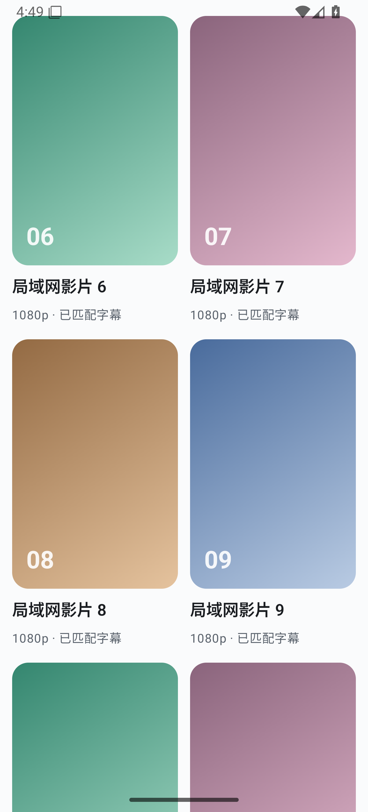

<p align="center">
  
</p>

# LanPlay — 局域网 SMB 媒体播放器 / LAN SMB Media Player

[](https://github.com/ferretgeek/LanPlay/actions/workflows/ci.yml)
[](./LICENSE)
[](#快速开始)

> 局域网里的私人影院。直接浏览和播放 SMB 共享中的视频，不需要把媒体库上传到云端。  
> A private cinema for your local network. Browse and play videos from SMB shares without uploading your library to the cloud.

## 中文

LanPlay 是一个面向 Android 8.0 及以上设备的本地优先播放器。它把 SMB 2/3 文件浏览、播放、字幕、观看记录、媒体整理与隐私保护放在同一个原生 Android 应用中；Android 端播放时不依赖公网服务。

### 核心能力

- **原生 SMB 工作流：** 局域网扫描、共享发现、访客或账号连接、目录浏览、搜索与排序。
- **双播放内核：** Media3 为主，libVLC 作为兼容回退；支持硬件解码、倍速、画面适配和帧率匹配。
- **字幕与音轨：** 自动匹配外挂字幕，可切换字符集、内嵌音轨和外挂音轨。
- **本地媒体状态：** 续播、观看历史、书签、标签、备注、回收站与备份恢复。
- **全局视觉主题：** 多套浅色配色与 `#17191d` 深灰模式贯穿浏览、详情与播放界面。
- **隐私优先：** 没有账号系统、云同步或遥测；凭据只在设备本地加密保存，日志会主动脱敏。
- **可选 PC 刮削器：** 预先生成海报和结构化元数据，Android 应用只通过 SMB 读取结果。

### 真实界面预览

下图来自项目内置的匿名性能画廊：不连接 SMB、不读取私人媒体，也不包含真实账号或文件名。

<p align="center">
  
</p>

### 快速开始

准备 JDK 21、Android SDK 37 与 Android Studio，然后：

```powershell
cd LanPlay
.\gradlew.bat :app:assembleDebug --no-daemon --max-workers=2
```

生成的 debug APK 位于 `LanPlay/app/build/outputs/apk/debug/`。Release 构建必须通过工作区外的环境变量或签名配置提供密钥；仓库不包含任何签名文件。

运行测试：

```powershell
cd LanPlay
.\gradlew.bat :app:testDebugUnitTest --no-daemon --max-workers=2

cd ..\lanplay-scraper
.\.venv\Scripts\python.exe -m unittest -v
```

刮削器的安装、配置和网络安全边界见 [`lanplay-scraper/README.md`](./lanplay-scraper/README.md)。真实目录只应写入已忽略的 `config.toml`。

### 目录

```text
LanPlay/             Android 应用与 Gradle 工程
lanplay-scraper/     可选 Windows/Python 元数据刮削器
docs/images/         脱敏后的真实预览与分享封面
播放器规格.md         已实现的产品与技术规格
设计系统.md           视觉、布局与交互规范
需求文档.md           完整需求与验收边界
```

### 当前边界

- 首次公开版本提供完整源码，不发布通用签名 APK；请自行构建，避免把开发签名误当成可信分发身份。
- SMB 服务器、网络质量、设备厂商后台策略和解码能力会影响实际体验。
- 可选刮削器访问公开第三方页面；使用者应遵守所在地法律与相应站点条款。

## English

LanPlay is a local-first media player for Android 8.0 and later. It combines SMB 2/3 browsing, playback, subtitles, watch state, library tools, and privacy protection in one native Android app. Playback itself does not require a public internet service.

### Highlights

- **Native SMB workflow:** LAN scanning, share discovery, guest or account connections, browsing, search, and sorting.
- **Two playback engines:** Media3 by default with libVLC as a compatibility fallback, plus hardware decoding, speed control, scaling, and frame-rate matching.
- **Subtitles and audio:** Automatic external-subtitle matching, charset selection, embedded tracks, and external audio tracks.
- **Local media state:** Resume, history, bookmarks, tags, notes, trash, backup, and restore.
- **Global visual themes:** Multiple light palettes and a `#17191d` deep-gray mode span browsing, details, and playback.
- **Privacy first:** No account system, cloud sync, or telemetry. Credentials stay encrypted on-device and logs are redacted.
- **Optional PC scraper:** Generate posters and structured metadata ahead of time; the Android app reads the result over SMB.

### Build

Install JDK 21, Android SDK 37, and Android Studio, then run:

```powershell
cd LanPlay
.\gradlew.bat :app:assembleDebug --no-daemon --max-workers=2
```

The debug APK is written to `LanPlay/app/build/outputs/apk/debug/`. Release signing is accepted only from environment variables or a configuration outside the workspace; no signing material is committed.

The first public version ships source code rather than a generally trusted signed APK. Server behavior, network quality, vendor background policies, and device decoders can affect playback. See the Chinese section and project documents for the full verification boundary.

## License

LanPlay source code is released under the [MIT License](./LICENSE). Third-party libraries, including libVLC, keep their own licenses and are not relicensed by this repository.
